# Крестики-нолики API

Краткое описание проекта и его структуры.

## Архитектура

Проект разделен на 4 слоя:

- `web` обрабатывает HTTP-запросы и формирует HTTP-ответы.
- `domain` содержит правила игры и логику алгоритма Minimax.
- `datasource` хранит игры в памяти.
- `di` связывает зависимости между слоями.

### Поток запроса

```mermaid
flowchart LR
  A["HTTP client"] --> B["web/route/game_route.py"]
  B --> C["web/mapper/current_game_mapper.py"]
  C --> D["domain/service/tic_tac_toe_service.py"]
  D --> E["datasource/repository/current_game_repository.py"]
  E --> F["datasource/mapper/current_game_mapper.py"]
  F --> G["datasource/model/game_state_storage.py"]
```



## API

### `POST /game`

Создает новую игру.

Пример ответа:

```json
{
  "game_id": "550e8400-e29b-41d4-a716-446655440000",
  "board": {
    "cells": [
      [0, 0, 0],
      [0, 0, 0],
      [0, 0, 0]
    ]
  }
}
```

### `POST /game/<uuid>`

Принимает следующий ход игрока для существующей игры и возвращает обновленное поле.

Пример тела запроса:

```json
{
  "board": {
    "cells": [
      [1, 0, 0],
      [0, 0, 0],
      [0, 0, 0]
    ]
  }
}
```

Пример ответа:

```json
{
  "game_id": "550e8400-e29b-41d4-a716-446655440000",
  "board": {
    "cells": [
      [1, 0, 0],
      [0, 2, 0],
      [0, 0, 0]
    ]
  }
}
```

Обозначения:

- `0` — пустая клетка.
- `1` — ход игрока.
- `2` — ход компьютера.
- За один запрос игрок может изменить только одну клетку.

## Файлы

### Точка входа

- `app.py` запускает приложение.

### Слой `di`

- `di/container.py` создает один общий экземпляр хранилища, затем формирует репозиторий и сервис.

### Слой `web`

- `web/module/app_module.py` создает Flask-приложение и регистрирует маршруты.
- `web/route/game_route.py` определяет HTTP endpoint-ы.
- `web/mapper/current_game_mapper.py` преобразует JSON-запрос в доменные объекты и доменные объекты в JSON-ответ.
- `web/model/web_board.py` определяет модель веб-доски.
- `web/model/web_game.py` определяет модель веб-игры.

### Слой `domain`

- `domain/model/board.py` определяет игровое поле и проверяет его состояние.
- `domain/model/current_game.py` определяет игру.
- `domain/service/game_service.py` задает интерфейс игрового сервиса.
- `domain/service/tic_tac_toe_service.py` содержит игровую логику, валидацию хода, проверку состояния игры и алгоритм Minimax.

### Слой `datasource`

- `datasource/model/game_state_storage.py` хранит все игры в памяти.
- `datasource/model/stored_board.py` определяет модель хранения доски.
- `datasource/model/stored_game.py` определяет модель хранения игры.
- `datasource/mapper/current_game_mapper.py` преобразует доменные модели в модели хранения и обратно.
- `datasource/repository/current_game_repository.py` предоставляет операции сохранения и получения игр.

### Вспомогательные файлы

- `Makefile` удаляет папки `__pycache__`.

## Запуск

Из корня проекта:

```powershell
python src\app.py
```

Если зависимости еще не установлены, установите их командой:

```powershell
pip install -r src\requirements.txt
```

После запуска сервера отправляйте `POST`-запросы на:

- `http://127.0.0.1:5000/game` — создание новой игры.
- `http://127.0.0.1:5000/game/<uuid>` — отправка следующего хода.

